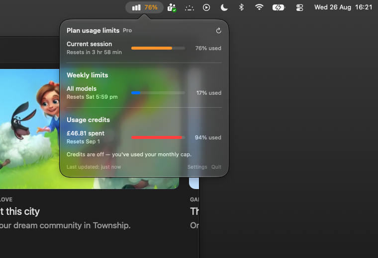

# Claude Usage

A tiny macOS menu bar app that shows your Claude Code plan usage — session
limit, weekly limits, and usage credits — in a popover, mirroring the Usage
pane in the Claude desktop app.




*(The popover shot predates the icon change, so it still shows the old
placeholder glyph in the menu bar; the popover itself is current.)*

## Build & install

```bash
./build.sh
cp -R build/ClaudeUsage.app /Applications/
open /Applications/ClaudeUsage.app
```

Requires the Xcode Command Line Tools (`xcode-select --install`) and macOS 13+.
No other dependencies — it's a single Swift binary against AppKit/SwiftUI.

## Usage

- **Left click** the menu bar item to open the usage popover.
- **Right click** for a menu: Refresh Now, Open Claude, Show Percentage in
  Menu Bar, Launch at Login, Quit.
- **Open Claude** (in the popover footer and the right-click menu) launches the
  Claude desktop app, or opens claude.ai if it isn't installed.
- The menu bar shows the Claude burst mark plus your current session
  percentage, turning orange at 75% and red at 90%.

## The icon

There's no official Claude icon asset installed on this machine to link
against, so `ClaudeGlyph.swift` **draws an approximation of the burst mark** —
eleven round-capped rays of alternating length — as a template image, which
macOS tints automatically for light/dark menu bars.

To use the real artwork instead, drop a PNG here and restart the app:

```
~/Library/Application Support/ClaudeUsage/menubar-icon.png
```

It's loaded as a template image, so use a solid black glyph on transparency and
macOS handles the tinting. A 32×32 or 64×64 PNG works well.

## How it works

It reads the OAuth token Claude Code already stores in your login Keychain
(`Claude Code-credentials`) and calls the same endpoint the Claude apps use:

```
GET https://api.anthropic.com/api/oauth/usage
    Authorization: Bearer <token>
    anthropic-beta: oauth-2025-04-20
```

The response's `limits` array drives the rows, so per-model windows
(`weekly_opus`, `weekly_sonnet`, …) that only appear on Max plans render
automatically without a code change. `spend` drives the usage-credits row.

The token is read fresh from the Keychain on every poll and never written to
disk — Claude Code owns refreshing it. If it expires, sign in again by running
`claude` in a terminal.

### Rate limiting

The usage endpoint rate limits at roughly **one request per 250 seconds**
(HTTP 429 with `retry-after`). The app therefore:

- polls every 5 minutes,
- skips the refresh-on-open if the data is under 60 seconds old,
- honours `retry-after` and retries once the window expires,
- caches the plan name (a second endpoint) for the process lifetime,
- keeps showing the last good figures instead of blanking on an error.

If you hammer **Refresh Now**, you will get a 429 — the popover will say so and
recover on its own.

## Notes

- The credits reset date isn't in the API response; credits roll over on the
  1st of the month, which is what the app displays.
- `spend.enabled` is *effective* spendability, not the credits switch — it goes
  false once the monthly cap is used up even though credits are still on. The
  on/off state comes from `extra_usage.user_disabled` instead, so a used-up cap
  no longer reads as "credits are off".
- `--open` is a debug flag that opens the popover on launch, useful for
  testing without clicking the menu bar.
- The app is ad-hoc signed by `build.sh` so it keeps a stable identity across
  rebuilds and macOS doesn't re-prompt for Keychain access each time.
